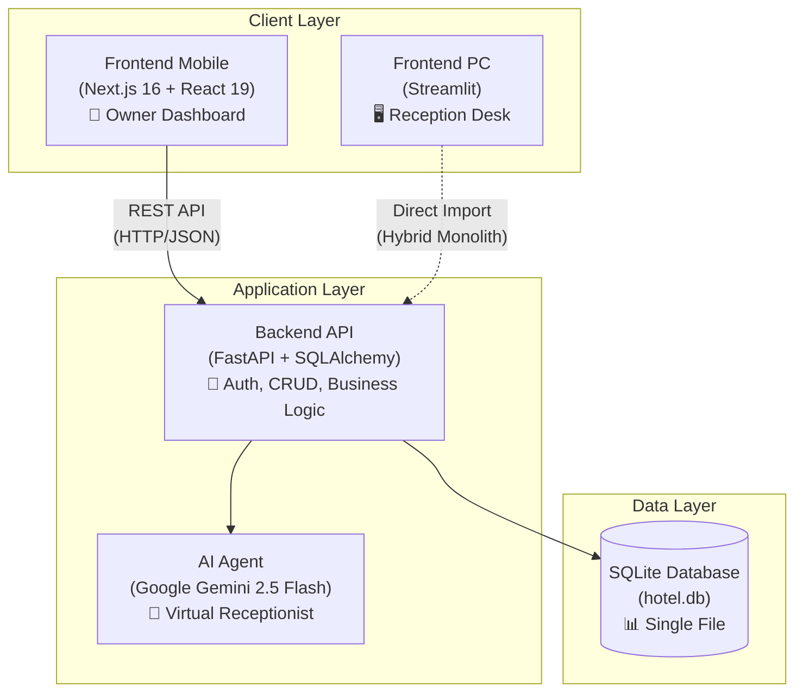

# PROJECT_CONTEXT.md
# Hotel Management System - Single Source of Truth
**Last Updated:** 2026-02-12
**Phase:** Los Monges MVP Deployment

---

## EXECUTIVE SUMMARY

**What:** A Hotel Management System (HMS) for "Hospedaje Los Monges" — category-based (sells by room type, not room number).

**Architecture:** Hybrid Monolith
- PC Frontend (Streamlit) imports backend directly (local deployment)
- Mobile Frontend (Next.js) uses REST API (clean separation)
- Both access the same SQLite database (`backend/hotel.db`)

**Business requirements:** See `REQUIREMENTS.md`
**Audit status:** See `claude_audit/00_SYNTHESIS_REPORT.md`

---

## PROJECT STRUCTURE

```
hotel_munich/
├── backend/
│   ├── database.py              # SQLAlchemy models, DB connection
│   ├── schemas.py               # Pydantic validation schemas
│   ├── logging_config.py        # Centralized logging
│   ├── hotel.db                 # SQLite database (SINGLE SOURCE OF TRUTH)
│   ├── services/                # Business logic (PACKAGE - extracted 2026-02-08)
│   │   ├── __init__.py          # Re-exports all classes for backward compat
│   │   ├── _base.py             # get_db(), @with_db hybrid decorator
│   │   ├── auth_service.py      # AuthService (115 LOC)
│   │   ├── reservation_service.py # ReservationService (595 LOC)
│   │   ├── guest_service.py     # GuestService (160 LOC)
│   │   ├── settings_service.py  # SettingsService (84 LOC)
│   │   ├── pricing_service.py   # PricingService (136 LOC)
│   │   └── room_service.py      # RoomService (202 LOC)
│   └── api/                     # FastAPI routes
│       ├── core/                # security.py, config.py
│       ├── deps.py              # Auth dependencies + RBAC
│       ├── main.py              # App + CORS + security headers middleware
│       └── v1/endpoints/        # auth, reservations, guests, rooms, calendar,
│                                # agent, vision, settings, pricing, users
│
├── frontend_pc/                 # Streamlit PC app (MODULARIZED 2026-02-08)
│   ├── app.py                   # Orchestrator (116 LOC) — login, sidebar, tabs
│   ├── components/              # UI rendering modules
│   │   ├── styles.py            # inject_custom_css() (96 LOC)
│   │   ├── calendar_render.py   # render_native_calendar() (205 LOC)
│   │   ├── tab_calendario.py    # Monthly/weekly/daily views (171 LOC)
│   │   ├── tab_reserva.py       # Reservation form — multi-category (restructured 2026-02-09)
│   │   └── tab_checkin.py       # Guest check-in form (176 LOC)
│   ├── helpers/                 # Shared utilities
│   │   ├── constants.py         # MESES_ES, DIAS_SEMANA, legacy lists
│   │   ├── data_fetchers.py     # @st.cache_data functions
│   │   ├── auth_helpers.py      # log_login, log_logout, logout
│   │   └── ui_helpers.py        # Validation formatting, Gemini doc analysis
│   ├── frontend_services/       # cache_service.py
│   ├── api_client.py            # HTTP client for config
│   └── pages/                   # Streamlit multipage
│       ├── 04_Asistente_IA.py   # AI chat assistant
│       ├── 09_Configuracion.py  # Hotel settings
│       └── 99_Admin_Users.py    # User administration
│
├── frontend_mobile/             # Next.js 16 + React 19 + TypeScript
│   ├── src/
│   │   ├── constants/keys.ts    # ACCESS_TOKEN_KEY, API_BASE_URL
│   │   ├── services/            # rooms, pricing, auth, reservations, vision, chat
│   │   └── hooks/               # useAuth, useBeaconLogout
│   └── app/dashboard/
│       ├── reservations/new/    # (MODULARIZED 2026-02-08)
│       │   ├── page.tsx         # Orchestrator (286 LOC)
│       │   └── components/      # DocumentScanner, GuestForm, RoomSelection, PriceSummary
│       ├── calendar/page.tsx
│       ├── availability/page.tsx
│       └── chat/page.tsx
│
├── scripts/                     # Migration and seed scripts
├── start_backend.bat            # Starts FastAPI (uvicorn)
├── start_pc.bat                 # Sets PYTHONPATH=backend, runs Streamlit
├── PROJECT_CONTEXT.md           # THIS FILE
├── REQUIREMENTS.md              # Los Monges business requirements
└── claude_audit/                # Audit reports and tracking
    └── 00_SYNTHESIS_REPORT.md   # Active sprint tracker
```

---

## ARCHITECTURE



### Key Technical Patterns

| Pattern | Detail |
|---------|--------|
| **`@with_db` decorator** | Hybrid: auto-detects FastAPI (db injected) vs Streamlit (self-managed sessions). Lives in `services/_base.py`. **CRITICAL:** FastAPI endpoints MUST pass `db` to service methods — omitting it causes `SessionLocal.remove()` to kill the scoped session (see BUG-PRICING-02). |
| **`session_factory()` for FastAPI** | `deps.py:get_db()` uses `session_factory()` directly — NOT `SessionLocal` (scoped_session). `scoped_session` uses `threading.local()` which causes concurrency bugs when FastAPI's threadpool reuses threads. `SessionLocal` is only used by Streamlit via `@with_db`. |
| **PYTHONPATH** | `start_pc.bat` sets `PYTHONPATH=backend/`, so `from services import X` works from `frontend_pc/`. |
| **Backward-compat re-exports** | `services/__init__.py` re-exports all classes + schemas. All consumers unchanged. |
| **Cross-service deps** | `ReservationService` → `PricingService.calculate_price()`, `SettingsService.get_parking_capacity()`. No others. |
| **Centralized API client** | `api.ts` is the single gateway for all mobile HTTP calls. Auto-attaches JWT, handles FormData, consistent error handling. |
| **`useAuth` hook** | All protected mobile pages use `useAuth({ required: true })` for auth guards with automatic token refresh. |
| **Multi-category reservations** | Both frontends show all available rooms grouped by category. Users select rooms from any/multiple categories. Pricing calculates per-category and sums. Backend `create_reservations()` resolves each room's category from DB. |
| **Room ID vs internal_code** | `Room.id` = DB primary key (e.g. `los-monges-room-001`). `Room.internal_code` = human-friendly label (e.g. `DF-01`). All UIs display `internal_code`. Reservations store `room_id` but DTOs include `room_internal_code` for display. |
| **Date-range availability** | `/rooms/status?check_in=&check_out=` checks overlap across full range (prevents overbooking). Mobile re-fetches rooms when dates change. |

---

## STABILITY RATING

**Overall Grade: A- (Production-Ready)**

| Component | Rating | Notes |
|-----------|--------|-------|
| Backend API | A | FastAPI + SQLAlchemy. N+1 fixed. Pricing engine validated. |
| PC App | A- | Modularized (116 LOC orchestrator). Caching optimized. |
| Mobile App | A | Connectivity issues resolved. Booking flow active. |
| Database | A- | SQLite with indexes. Performance optimized. WAL mode. |
| AI Agent | A | Gemini 2.5 Flash stable with fallback. 30s timeout. |
| Security | A+ | RBAC. JWT revocation. Error sanitization. Security headers. |

---

## GAP ANALYSIS: MVP vs. GLOBAL SAAS

| Capability | Los Monges MVP (Now) | Full SaaS (Phase 2+) | Debt |
|------------|----------------------|----------------------|------|
| Multi-Tenancy | No `tenant_id` | Required on ALL tables | Schema migration |
| Database | SQLite (local file) | PostgreSQL (managed) | Connection pooling |
| Authentication | JWT (single hotel) | Tenant-aware + SSO | OAuth2 |
| Billing | N/A | Stripe integration | New tables |
| Scalability | Vertical (single server) | Horizontal (LB) | Refactor PC app |

**Migration Trigger:** Client #3 or >20 concurrent users.

---

## RISK REGISTER

| Risk | Probability | Impact | Mitigation |
|------|-------------|--------|------------|
| SQLite write contention at peak | MEDIUM | HIGH | WAL mode enabled. Plan PostgreSQL migration. |
| Category pricing bugs | LOW | MEDIUM | **Materialized 2026-02-09:** missing `currency` field + missing `db` param. Fixed. Now mitigated by: Pydantic response validation, per-category pricing breakdown visible in both UIs, all endpoints audited for `db` passing. |
| scoped_session concurrency in FastAPI | LOW | HIGH | **Materialized 2026-02-10:** `SessionLocal` (scoped_session) shared sessions across threadpool threads. Fixed: `deps.py` now uses `session_factory()` directly. `SessionLocal` only used by Streamlit. |
| Overbooking (room double-booking) | LOW | HIGH | **Materialized 2026-02-10:** Room status loaded for TODAY only, never re-checked for selected dates. Fixed: date-range overlap API + frontend re-fetch on date change. |
| Multi-tenant data leak (if tenant_id not added before Client #2) | HIGH | CRITICAL | Block Client #2 until tenant isolation is live. |

---

## TECHNICAL DECISIONS

| Decision | Why | When to Revisit |
|----------|-----|-----------------|
| Streamlit for PC | Pure Python, zero frontend learning curve, internal tool | >10 concurrent receptionists |
| Next.js for Mobile | SSR, TypeScript, SaaS-ready UX | Never (strategic) |
| SQLite | Zero-config, single file, sufficient for <15 users | Client #3 or >20 users |
| Hybrid Monolith | No network latency for PC, simpler deployment | True multi-tenant SaaS |
| services/ package | `__init__.py` re-exports preserve all import paths | Stable |

---

## VERIFIED IMPLEMENTATIONS

### Security
| Feature | Status |
|---------|--------|
| `.env` for secrets | Done |
| bcrypt passwords | Done |
| Rate limiting (5/min login) | Done |
| Session cleanup (startup + beacon) | Done |
| CORS hardening (explicit whitelist) | Done |
| Endpoint auth (JWT on all sensitive) | Done |
| RBAC enforcement (`require_role()`) | Done |
| JWT revocation (session-based) | Done |
| Error sanitization + global handler | Done |
| Security headers middleware (VULN-09) | Done |

### Performance
| Feature | Status |
|---------|--------|
| `@st.cache_data` TTL-based | Done |
| WAL mode SQLite | Done |
| Rotating logs | Done |
| N+1 query fix (batch room fetch) | Done |
| Date query bounds (365-day limit) | Done |
| Database indexes | Done |
| Vision hardening (5MB + 30s timeout) | Done |
| Occupancy map lower bound (PERF-003) | Done |
| Remove time.sleep() (PERF-11) | Done |

### Structure
| Feature | Status |
|---------|--------|
| services.py → services/ package (STRUCT-05) | Done |
| app.py split into components/ + helpers/ (STRUCT-04) | Done |
| Mobile reservation page → 4 components (STRUCT-06) | Done |
| Admin pages use API (V8, V9) | Done |
| ai_tools through service layer (V2-V3) | Done |
| Centralized api.ts + useAuth hook (STRUCT-08) | Done |
| All endpoints pass `db` to services (BUG-PRICING-02) | Done |
| FastAPI uses `session_factory()` not `SessionLocal` (BUG-SESSION-01) | Done |
| CORS middleware outermost + global handler CORS (BUG-CORS-01) | Done |
| Date-range overbooking prevention (BUG-OVERBOOKING-01) | Done |
| All UIs display `internal_code` not `room_id` (BUG-ROOMNAME-01) | Done |
| Multi-category room selection (FEAT-MULTICATEGORY) | Done |
| Pydantic response schemas validated (BUG-PRICING-01) | Done |

---

## CHANGELOG

| Date | Change | Author |
|------|--------|--------|
| 2026-01-30 | Initial version | Claude Desktop |
| 2026-01-31 | Added pricing system (client types, seasons, contracts) | Claude Desktop |
| 2026-02-03 | Phase 1 (Database, Backend, Frontend PC/Mobile) DONE | Antigravity |
| 2026-02-04 | Security: CORS whitelist, endpoint auth (VULN-002, VULN-003) | Claude Opus 4.5 |
| 2026-02-04 | Performance: N+1 queries, date bounds, DB indexes (PERF-001, 002, 006) | Claude Opus 4.5 |
| 2026-02-04 | Code quality: TOKEN-01 (centralized keys), ZOMBIE-01/02 (cleanup) | Claude Opus 4.5 |
| 2026-02-05 | Architecture: V8/V9 (admin→API), V2-V3 (ai_tools→service layer), PERF-004 (pagination) | Claude Opus 4.5 |
| 2026-02-06 | Security: VULN-005 (RBAC), VULN-004 (JWT revocation), VULN-007 (error sanitization) | Claude Opus 4.6 |
| 2026-02-06 | Architecture: V1 (AuthService.login), PERF-08-10 (vision hardening), global exception handler | Claude Opus 4.6 |
| 2026-02-08 | **STRUCT-05**: Extracted `services.py` (1379 LOC) → `services/` package (8 modules) | Claude Opus 4.6 |
| 2026-02-08 | **STRUCT-04**: Split `app.py` (1400 LOC) → orchestrator (116 LOC) + `components/` + `helpers/` (10 modules) | Claude Opus 4.6 |
| 2026-02-08 | **PERF-003**: Occupancy map SQL optimization (lower bound filter) | Claude Opus 4.6 |
| 2026-02-08 | **PERF-11**: Removed `time.sleep()` from reservation flow | Claude Opus 4.6 |
| 2026-02-08 | **VULN-09**: Added security headers middleware (X-Content-Type-Options, X-Frame-Options, etc.) | Claude Opus 4.6 |
| 2026-02-08 | **STRUCT-06**: Split mobile `page.tsx` (750 LOC) → orchestrator (286 LOC) + 4 components | Claude Opus 4.6 |
| 2026-02-08 | Docs consolidation: retired TECHNICAL_BASELINE_REPORT (merged into this file) | Claude Opus 4.6 |
| 2026-02-08 | **STRUCT-08**: Route all fetch() through `api.ts` + adopt `useAuth` hook across pages | Claude Opus 4.6 |
| 2026-02-09 | **BUG-PRICING-01**: Fixed missing `currency` field in `pricing_service.py` (ResponseValidationError on every pricing call) | Claude Opus 4.6 |
| 2026-02-09 | **BUG-PRICING-02**: Fixed `pricing.py` endpoint not passing `db` to `get_client_types()` (SQLAlchemy identity map crash) | Claude Opus 4.6 |
| 2026-02-09 | **BUG-PC-FORM-01**: Fixed PC reservation form — category/room selectors were inside `st.form()`, never triggering reruns | Claude Opus 4.6 |
| 2026-02-09 | **FEAT-MULTICATEGORY**: Multi-category room selection in both PC and mobile frontends. Rooms grouped by category, per-category pricing. | Claude Opus 4.6 |
| 2026-02-10 | **BUG-SESSION-01**: Fixed `scoped_session` concurrency — `deps.py` now uses `session_factory()`. Eliminated "identity map is no longer valid" and "concurrent operations" errors. | Claude Opus 4.6 |
| 2026-02-10 | **BUG-CORS-01**: Fixed CORS middleware ordering (outermost) + added CORS headers to global exception handler. Eliminated "Failed to fetch" browser errors. | Claude Opus 4.6 |
| 2026-02-10 | **BUG-OVERBOOKING-01**: Added `get_range_status()` + `/rooms/status?check_in&check_out` params. Mobile re-fetches rooms on date change. Prevents double-booking. | Claude Opus 4.6 |
| 2026-02-10 | **BUG-ROOMNAME-01**: All UIs now display `internal_code` (e.g. `DF-01`) instead of `room_id` (e.g. `los-monges-room-001`). Fixed in: weekly view, daily view, reservation lists (PC + mobile), calendar. | Claude Opus 4.6 |
| 2026-02-12 | **BUG-ROOMNAME-02**: AI agent tools now display `internal_code` in all 4 tool responses. Fixed `search_reservations()`, `get_reservations_in_range()`, `search_checkins()` to include `room_code`. | Claude Opus 4.6 |

---

**END OF PROJECT CONTEXT**
