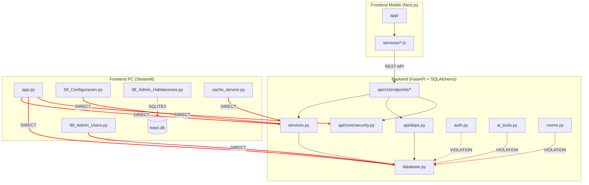

# Dependency & Architecture Analysis Report
## Hotel Munich PMS - Hybrid Monolith

**Analysis Date:** 2026-02-04
**Architecture:** Backend (FastAPI + SQLAlchemy) | Frontend PC (Streamlit) | Frontend Mobile (Next.js 16)

> **STATUS UPDATE (2026-02-25):** All critical violations (V1, V2-V3, V8, V9) and high violations (V4, V7) have been fully resolved. All zombie code has been deleted or refactored. Token keys centralized in `src/constants/keys.ts`. Configuration gaps addressed. Frontend PC admin pages migrated from direct DB access to API client. `services.py` extracted to 8-module package. Only V6 and V10 remain as **INTENTIONAL** hybrid architecture patterns (documented). Remaining backlog: STRUCT-12 (snake_case rename), STRUCT-13 (English constants).

---

## Part A: Dependency Map (Mermaid)



**Legend:** Red dashed lines = Architectural violations

---

## Part B: Violation Table

| ID | Type | Source File | Target | Severity | Fix | Status |
|----|------|-------------|--------|----------|-----|--------|
| **V1** | Layer Skip | `backend/api/v1/endpoints/auth.py:97-136` | `database.User, SessionLog` | **CRITICAL** | Create `AuthService.login()` | **RESOLVED** (2026-02-08) |
| **V2** | Layer Skip | `backend/api/v1/endpoints/ai_tools.py:220-304` | `database.SessionLocal, Reservation` | **CRITICAL** | Use `ReservationService.search()` | **RESOLVED** (2026-02-08) |
| **V3** | Layer Skip | `backend/api/v1/endpoints/ai_tools.py:310-405` | `database.SessionLocal, Reservation` | **CRITICAL** | Use `ReservationService.get_report()` | **RESOLVED** (2026-02-08) |
| **V4** | Layer Skip | `backend/api/v1/endpoints/rooms.py:82-104` | `database.Room, RoomCategory` | **HIGH** | Use `RoomService.get_all_rooms()` | **RESOLVED** (2026-02-08) |
| **V5** | Direct Import | `backend/api/v1/endpoints/settings.py:1-14` | `database.User` | **MEDIUM** | Remove, use `get_current_user()` | **RESOLVED** (2026-02-13) |
| **V6** | Direct Backend | `frontend_pc/app.py:16-28` | `services.*, database.*` | **INTENTIONAL** | Document as hybrid pattern | **INTENTIONAL** — documented |
| **V7** | Direct Backend | `frontend_pc/pages/09_Configuracion.py:5-9` | `sys.path.append`, `services.*` | **HIGH** | Use API endpoints | **RESOLVED** (2026-02-13) |
| **V8** | Direct DB | `frontend_pc/pages/98_Admin_Habitaciones.py:95-282` | `sqlite3.connect(DB_PATH)` | **CRITICAL** | Use API endpoints | **RESOLVED** (2026-02-13) |
| **V9** | Direct Backend | `frontend_pc/pages/99_Admin_Users.py:18-22` | `database.*, api.core.security` | **CRITICAL** | Use API endpoints | **RESOLVED** (2026-02-13) |
| **V10** | Direct Backend | `frontend_pc/frontend_services/cache_service.py:16` | `services.ReservationService` | **INTENTIONAL** | Document as hybrid pattern | **INTENTIONAL** — documented |

### Critical Layer Violations Detail:

**V2-V3: ai_tools.py creates its own database sessions**
```python
# ai_tools.py:221,330 - WRONG
from database import SessionLocal, Reservation, CheckIn
db = SessionLocal()
results = db.query(Reservation).filter(...)  # Bypasses service layer
```

**V8: Admin page uses raw SQLite bypassing entire stack**
```python
# 98_Admin_Habitaciones.py:95 - CRITICAL
def get_db_connection():
    return sqlite3.connect(str(DB_PATH))  # Direct file access!
```

---

## Part C: Zombie Code List

| File | Type | Issue | Action | Status |
|------|------|-------|--------|--------|
| `frontend_mobile/src/app/login/page.tsx` | Dead File | Duplicate of `app/login/page.tsx`, never routed | **DELETE** | **DELETED** (2026-02-08) |
| `frontend_mobile/app/page.tsx` | Dead File | Default Next.js boilerplate, app starts at `/login` | **DELETE** | **DELETED** (2026-02-08) |
| `frontend_mobile/src/services/api.ts:101-146` | Unused Exports | `apiGet`, `apiPost`, `apiPut`, `apiDelete` never imported | **DELETE** | **DELETED** (2026-02-08) |
| `frontend_mobile/src/services/chat.ts:59-61` | Unused Function | `generateMessageId()` not used | **DELETE** | **DELETED** (2026-02-08) |
| `frontend_mobile/src/services/reservations.ts:104-120` | Unused Function | `getDatesWithReservations()` duplicated inline | **DELETE** | **DELETED** (2026-02-08) |
| `frontend_mobile/app/dashboard/calendar/page.tsx:24-39` | Duplicate Logic | `getStatusBadge()` duplicates `reservations.ts:125-168` | **REFACTOR** | **REFACTORED** (2026-02-08) |
| `frontend_pc/app.py:112-120` | Legacy Fallback | `LISTA_HABITACIONES_LEGACY`, `LISTA_TIPOS_LEGACY` | **EVALUATE** | **KEPT** — still used by hybrid pattern |

### No Backup Files Found
- `*_backup.*` - 0 files
- `*_old.*` - 0 files
- `*.bak` - 0 files

### TODO/FIXME Comments (3 found)

| File | Line | Content | Priority | Status |
|------|------|---------|----------|--------|
| `backend/services.py` | 885 | `# TODO: Advanced - Check seasonal base price variation?` | LOW | Moved to `services/pricing_service.py` |
| `backend/api/v1/endpoints/settings.py` | 97 | `# TODO: Add auth dependency here for Admin only` | **HIGH** | **RESOLVED** — RBAC added (2026-02-13) |
| `backend/schemas.py` | 217 | `# RUC paraguayo: XXXXXXXX-X` (comment, not TODO) | N/A | N/A |

---

## Part D: Configuration Gaps

### Backend Environment Variables

| Variable | In `.env.example` | Used in Code | Status |
|----------|-------------------|--------------|--------|
| `DB_NAME` | YES | NO | **UNUSED** - DB path hardcoded |
| `GOOGLE_API_KEY` | YES | YES (`vision.py:31`, `agent.py:63`) | OK |
| `JWT_SECRET_KEY` | **NO** | YES (`config.py:20`) | **CRITICAL GAP** |

**Critical Finding:** `JWT_SECRET_KEY` is required by `api/core/config.py:20-27` but missing from `.env.example`

### Frontend Mobile Environment Variables

| Variable | In `.env.example` | Used in Code | Status |
|----------|-------------------|--------------|--------|
| `NEXT_PUBLIC_API_URL` | Unknown | YES (12 files) | **NEEDS DOCUMENTATION** |

**Duplication Issue:** `API_URL` declared identically in 12 files instead of centralized import

### Hardcoded Values That Should Be Configurable

| File | Line | Value | Should Be |
|------|------|-------|-----------|
| `frontend_pc/pages/98_Admin_Habitaciones.py` | 32 | `DB_PATH = SCRIPT_DIR / "backend" / "hotel.db"` | Env var |
| `frontend_pc/pages/98_Admin_Habitaciones.py` | 35 | `PROPERTY_ID = "los-monges"` | Env var |
| `frontend_pc/pages/04_Asistente_IA.py` | 34-36 | `API_BASE_URL = "http://localhost:8000"` | Env var |

---

## Part E: Additional Findings

### Circular Dependencies
**Status:** NONE FOUND - Dependency graph is acyclic

### Utility Sprawl
**Status:** MINIMAL - `services/` package (8 modules) acts as service layer with clean separation

### Shared Mutable State

| Location | Pattern | Risk | Status |
|----------|---------|------|--------|
| `frontend_pc/app.py:526-554` | Streamlit `st.session_state` | LOW - Intentional per-session | OK |
| ~~`backend/ai_tools.py:221,330`~~ | ~~Creates own `SessionLocal()`~~ | ~~**HIGH** - Session leak risk~~ | **RESOLVED** — uses `Depends(get_db)` |

### ~~Token Key Inconsistency (Frontend Mobile)~~ — RESOLVED

~~| File | Key Used |~~
~~|------|----------|~~
~~| `auth.ts:11-12` | `hms_access_token`, `hms_refresh_token` |~~
~~| `chat.ts:8`, `rooms.ts:9`, `pricing.ts:33` | `hotel_munich_access_token` |~~

**RESOLVED (2026-02-04):** All token keys centralized in `src/constants/keys.ts`. Single source of truth: `ACCESS_TOKEN_KEY`, `REFRESH_TOKEN_KEY`.

---

## Summary Statistics

| Metric | Backend | Frontend PC | Frontend Mobile |
|--------|---------|-------------|-----------------|
| Python Files | 28 | 6 | 0 |
| TypeScript Files | 0 | 0 | 22 |
| Critical Violations | 3 | 2 | 0 |
| High Violations | 1 | 1 | 0 |
| Dead Code Files | 0 | 0 | 2 |
| Unused Functions | 0 | 0 | 5 |
| TODO Comments | 2 | 0 | 0 |
| External Deps | 13 | 8 | 5 (prod) |

---

## Recommended Actions (Priority Order)

### P0 - Critical (Security/Data Integrity) — ALL DONE

1. ~~**Add `JWT_SECRET_KEY` to `.env.example`**~~ — **DONE** (2026-02-04)
2. ~~**Fix ai_tools.py layer violations**~~ — **DONE** (2026-02-08), routed through services
3. ~~**Fix 98_Admin_Habitaciones.py**~~ — **DONE** (2026-02-13), migrated to API client
4. ~~**Add admin auth** to settings.py~~ — **DONE** (2026-02-13), RBAC `require_role()` added

### P1 - High (Code Quality) — ALL DONE

5. ~~**Create AuthService.login()**~~ — **DONE** (2026-02-08), extracted to `services/auth_service.py`
6. ~~**Standardize token keys**~~ — **DONE** (2026-02-04), centralized in `src/constants/keys.ts`
7. ~~**Centralize API_URL**~~ — **DONE** (2026-02-08), single export from `api.ts`
8. ~~**Delete zombie files**~~ — **DONE** (2026-02-08), both files removed

### P2 - Medium (Technical Debt) — MOSTLY DONE

9. ~~**Document hybrid architecture**~~ — **DONE** (2026-02-08), documented in PROJECT_CONTEXT.md
10. ~~**Remove unused exports**~~ — **DONE** (2026-02-08), cleaned from mobile services
11. ~~**Refactor duplicate getStatusBadge()**~~ — **DONE** (2026-02-08), shared utility
12. **Clean up legacy room lists** — BACKLOG (STRUCT-12/13, snake_case rename + English constants)

---

## Verification Checklist

- [x] Run `grep -r "from database import" backend/api/` - Only shows deps.py (**Verified 2026-02-13**)
- [x] Run `grep -r "SessionLocal()" backend/api/` - 0 results (**Verified 2026-02-13**)
- [x] Verify JWT_SECRET_KEY in .env.example (**Done 2026-02-04**)
- [x] Test frontend_mobile auth with standardized token keys (**Done 2026-02-08**)
- [x] Run backend tests after service layer refactoring (**224 tests passing, 2026-02-23**)