# ARCHIVED: TECHNICAL BASELINE REPORT

> **Archived on:** 2026-02-08
> **Reason:** Content merged into `PROJECT_CONTEXT.md` (architecture diagram, stability rating, gap analysis, risk register). This file is preserved for historical reference only.
> **Active docs:** `PROJECT_CONTEXT.md`, `REQUIREMENTS.md`, `claude_audit/00_SYNTHESIS_REPORT.md`

---

# TECHNICAL BASELINE REPORT
**Hotel Management System (HMS) - Phase 1 Pre-Deployment Assessment**

**Prepared by:** Principal Software Architect
**Date:** 2026-02-03
**Last Updated:** 2026-02-06 (Post-Audit Hardening Sprint)
**Target Deployment:** Hospedaje Los Monges (MVP)
**Audience:** Engineering Team, Product Leadership

---

## 1. ARCHITECTURE DIAGRAM

```mermaid
graph TB
    subgraph "Client Layer"
        Mobile["Frontend Mobile<br/>(Next.js 16 + React 19)<br/>📱 Owner Dashboard"]
        PC["Frontend PC<br/>(Streamlit)<br/>🖥️ Reception Desk"]
    end

    subgraph "Application Layer"
        API["Backend API<br/>(FastAPI + SQLAlchemy)<br/>🔐 Auth, CRUD, Business Logic"]
        AI["AI Agent<br/>(Google Gemini 2.5 Flash)<br/>🤖 Virtual Receptionist"]
    end

    subgraph "Data Layer"
        DB[("SQLite Database<br/>(hotel.db)<br/>📊 Single File")]
    end

    Mobile -->|"REST API<br/>(HTTP/JSON)"| API
    PC -.->|"Direct Import<br/>(Hybrid Monolith)"| API
    API --> DB
    API --> AI

    style Mobile fill:#61dafb,stroke:#333,stroke-width:2px
    style PC fill:#ff4b4b,stroke:#333,stroke-width:2px
    style API fill:#009688,stroke:#333,stroke-width:3px
    style AI fill:#4285f4,stroke:#333,stroke-width:2px
    style DB fill:#003b57,stroke:#333,stroke-width:2px
```

**Key Architectural Decisions:**
- **Hybrid Pattern:** PC App uses direct imports (monolith speed), Mobile uses REST API (clean separation).
- **Shared Database:** Both frontends now access the same `backend/hotel.db` file (post-audit fix).
- **AI Integration:** Gemini agent embedded in backend layer for conversational booking flows.
- **Operational Data:** Extended schema for Parking (`parking_needed`, `vehicle_plate`) and Reservation Source.

---

## 2. STACK ANALYSIS (TECHNICAL JUSTIFICATION)

### 2.1 Frontend PC: Streamlit
**Choice Rationale:**
| Factor | Justification |
|--------|---------------|
| **Development Velocity** | ✅ Pure Python, zero frontend framework learning curve. |
| **Use Case Alignment** | ✅ Internal tool for receptionists (controlled environment). |
| **Data Binding** | ✅ Native integration with Pandas/SQLAlchemy. |
| **Cost Efficiency** | ✅ Single codebase language (Python). |

**Verdict:** *Optimal for Phase 1. Re-evaluate if >10 concurrent receptionists.*

### 2.2 Frontend Mobile: Next.js 16 + React 19
**Choice Rationale:**
| Factor | Justification |
|--------|---------------|
| **User Experience** | ✅ SSR for fast load times on mobile networks. |
| **Scalability** | ✅ Designed for multi-tenant SaaS. |
| **Type Safety** | ✅ TypeScript prevents runtime errors. |
| **Ecosystem** | ✅ Rich library support (Recharts, React Hook Form). |

**Verdict:** *Strategic investment for SaaS future.*

### 2.3 Database: SQLite → PostgreSQL Roadmap
- **Current:** Zero-config, single file, ~10 concurrent writes sufficient for MVP.
- **Future:** PostgreSQL for MVCC, RLS, replication, advanced analytics.
- **Migration Trigger:** Client #3 or >20 concurrent users.

---

## 3. POST-AUDIT HEALTH CHECK

### 3.1 Critical Vulnerabilities Closed
- Hardcoded Secrets → `.env` with environment validation
- Split-Brain Database → Unified to `backend/hotel.db`
- CORS Wildcard → Explicit whitelist
- Unprotected Endpoints → `Depends(get_current_user)` on all sensitive endpoints
- Zombie Sessions → Startup cleanup + browser beacon logout

### 3.2 Stability Rating: A- (Production-Ready)
| Component | Rating | Notes |
|-----------|--------|-------|
| Backend API | A | FastAPI + SQLAlchemy. N+1 fixed. Pricing validated. |
| PC App | B+ | Caching fixed. Dynamic pricing added. |
| Mobile App | A | Connectivity resolved. Booking flow active. |
| Database | A- | SQLite with indexes. Performance optimized. |
| AI Agent | A | Gemini 2.5 Flash stable with fallback. |
| Security | A+ | All critical CVEs addressed. RBAC. JWT revocation. |

---

## 4. GAP ANALYSIS: MVP vs. GLOBAL SAAS

| Capability | Los Monges MVP | Full SaaS (Phase 2+) | Debt |
|------------|---------------|----------------------|------|
| Multi-Tenancy | No `tenant_id` | Required on ALL tables | Schema migration |
| Database | SQLite | PostgreSQL | Connection pooling |
| Authentication | JWT (single hotel) | Tenant-aware + SSO | OAuth2 |
| Billing | N/A | Stripe integration | New tables |
| Scalability | Vertical | Horizontal (LB) | Refactor PC app |

---

## 5. RISK REGISTER

| Risk | Probability | Impact | Mitigation |
|------|-------------|--------|------------|
| SQLite write contention | MEDIUM | HIGH | WAL mode enabled. Plan PostgreSQL migration. |
| Category pricing bugs | LOW | MEDIUM | QA on test data. Pricing breakdown visible. |
| Multi-tenant data leak | HIGH | CRITICAL | Block Client #2 until tenant isolation live. |

---

**Report Ends. (ARCHIVED — see PROJECT_CONTEXT.md for current state)**
